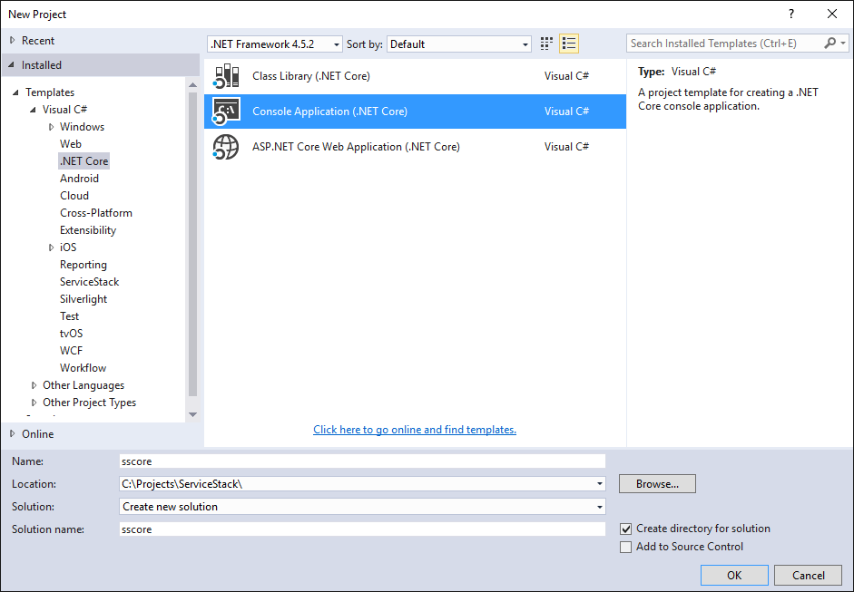
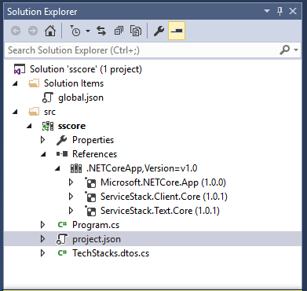

# How to run ServiceStack.Client on .NET Core

This guide shows how to create and execute .NET Core console application which
uses ServiceStack.Client 

## Install .NET Core                                                                                                                                                           

At the first step you need to install [Visual Studio 2015 update 3](https://go.microsoft.com/fwlink/?LinkId=691129)  and [.NET Core 1.0.0 - VS 2015 Tooling Preview](https://go.microsoft.com/fwlink/?LinkId=817245).
Also you need to install [ServiceStack Templates for Visual Studio](https://visualstudiogallery.msdn.microsoft.com/5bd40817-0986-444d-a77d-482e43a48da7).

To get more details about Visual Studio 2015 update 3 and .NET Core installation 
you can visit [.NET Core](https://www.microsoft.com/net/core#windows) site

## Create .NET Core Application

In Visual Studio click File->New->Project and select .NET Core/Console Application (.NET Core) 
from VS templates.

You will get following structure in Solution Explorer.

Right click on the project and select "Add ServiceStack Reference"

Then type in address field `http://techstacks.io` and `TechStacks` in name field and click "OK".

You should get following project structure

Please note that if you see yellow exclamation mark near ServiceStack references, 
this means you use old ServiceStackVS template and you should update it. Or just open `project.json`
and change `"ServiceStack.Text" : "4.0.60"` to `"ServiceStack.Text.Core" : "1.0.1"`
and `"ServiceStack.Client" : "4.0.60"` to `"ServiceStack.Client.Core" : "1.0.1"`

Then open file `Program.cs` and write the code

    using System;
    using ServiceStack;
    using TechStacks.ServiceModel;

    namespace ConsoleApplication
    {
        public class Program
        {
            public static void Main(string[] args)
            {
                using (var client = new JsonServiceClient("http://techstacks.io/"))
                {
                    var result = client.Get(new GetAllTechnologies());

                    //show the first technology from returned technologies
                    Console.WriteLine(result.Results[0].ToJson());
                }
            }
        }
    }

Then hit "run" button (F5). You should get following output in JSON form

# Limitations

`ServiceStack.Client.Core` is implemented to support [.NETStandard 1.1](https://github.com/dotnet/corefx/blob/master/Documentation/architecture/net-platform-standard.md) interface. 
This means that `ServiceStack.Client.Core` has limited support of the API methods
which are available in .NET 4.5 version of this library. These clients are not supported:
 - ServerEventsClient
 - WcsServiceClient
 - EncryptedServiceClient
